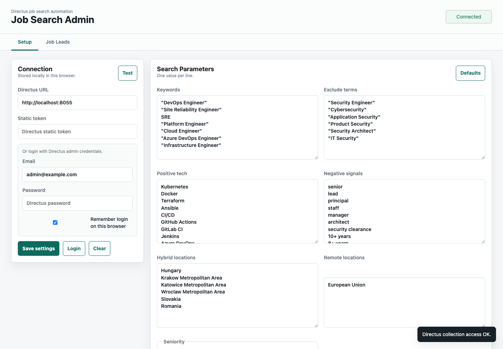
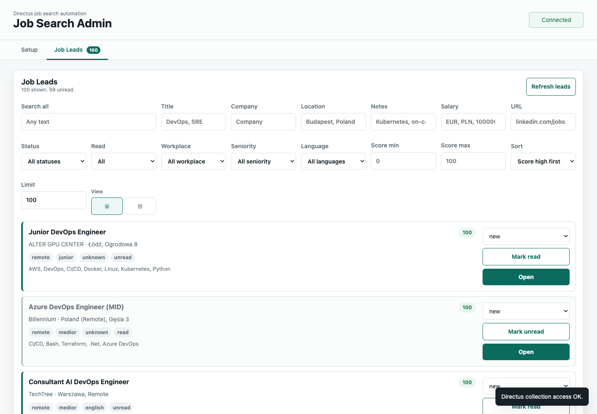
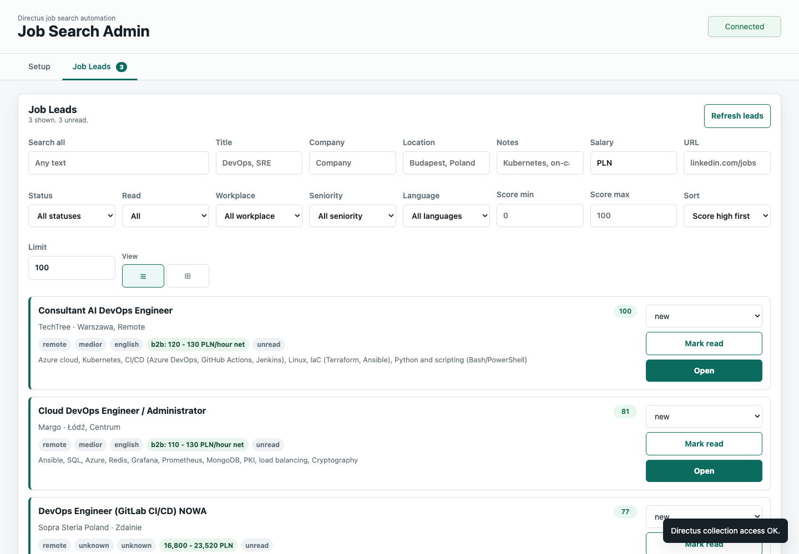

# Job Search Automation with Directus

[](https://github.com/nagyonmarci/jobs-hunter/actions/workflows/ci.yml)
[](https://github.com/nagyonmarci/jobs-hunter/actions/workflows/ci.yml)
[](https://securityscorecards.dev/viewer/?uri=github.com/nagyonmarci/jobs-hunter)
[](LICENSE)
[](package.json)

This is a small, runtime dependency-free TypeScript/Node.js starter for tracking DevOps/SRE/Platform job leads in Directus.

It does not scrape LinkedIn behind login. Instead it:

- generates targeted LinkedIn search URLs from your filters,
- stores search runs in Directus,
- imports public job cards from LinkedIn, No Fluff Jobs, Just Join IT, We Work Remotely, and EuroTopTech into Directus,
- ingests selected job leads from JSON into Directus,
- keeps status, score, public salary, notes, language, workplace, and seniority in one backend.

## Docker Compose

Create the environment file:

```bash
cp .env.example .env
```

Edit `.env` and set strong values for:

- `DIRECTUS_PASSWORD`
- `DIRECTUS_KEY`
- `DIRECTUS_SECRET`
- `POSTGRES_PASSWORD`

Start the stack:

```bash
docker compose up -d
```

Services:

- Directus: `http://localhost:8055`
- Admin UI behind OAuth: `http://localhost:4173/admin.html`
- job importer API: `http://localhost:4180`
- Postgres: internal Docker network only

Directus admin login comes from:

```text
DIRECTUS_EMAIL
DIRECTUS_PASSWORD
```

## OAuth gate

The admin UI is served behind `oauth2-proxy`. In Docker Compose, the public `4173` port belongs to the OAuth proxy, while the nginx admin service is only reachable inside the Docker network.

Create an OAuth application at your provider and register this callback URL for local use:

```text
http://localhost:4173/oauth2/callback
```

Configure `.env`:

```bash
OAUTH2_PROXY_PROVIDER=github
OAUTH2_PROXY_CLIENT_ID=your-client-id
OAUTH2_PROXY_CLIENT_SECRET=your-client-secret
OAUTH2_PROXY_COOKIE_SECRET=generated-cookie-secret
OAUTH2_PROXY_REDIRECT_URL=http://localhost:4173/oauth2/callback
OAUTH2_PROXY_EMAIL_DOMAINS=*
```

Generate the cookie secret:

```bash
openssl rand -base64 32
```

For Google or another OpenID Connect provider, use:

```bash
OAUTH2_PROXY_PROVIDER=oidc
OAUTH2_PROXY_OIDC_ISSUER_URL=https://accounts.google.com
```

For production, set `OAUTH2_PROXY_REDIRECT_URL` to your public HTTPS callback URL and `OAUTH2_PROXY_COOKIE_SECURE=true`.

Directus (`8055`) and the importer API (`4180`) are still exposed for local development. If you publish this outside your machine, put those services behind the same reverse proxy or remove their host port mappings.

## Directus collections

After the stack is up, run:

```bash
npm run provision:directus
```

This logs into Directus with `DIRECTUS_EMAIL` / `DIRECTUS_PASSWORD` unless `DIRECTUS_TOKEN` is set.

It creates:

- `job_leads`
- `job_search_runs`

`job_leads` stores normalized fields for each role, including source, source id, title, optional company, location, workplace, seniority, language, URL, apply URL, status, score, public salary/compensation, read state, and notes.

If your local shell cannot reach `localhost:8055`, run provisioning inside the Docker network:

```bash
docker compose run --rm directus-tools
```

## Admin UI

Open:

```text
http://localhost:4173/admin.html
```

The admin UI lets you:

- set Directus URL and token in browser local storage,
- edit keywords, hybrid locations, remote locations, seniority, and posted-within window,
- generate LinkedIn search URLs,
- save generated search runs into Directus,
- import concrete jobs from selected public sources,
- manually add reviewed job leads,
- review job leads with search, per-field filters, salary filtering, sorting, and read/unread marking.

For browser writes, create a Directus static token:

1. Open `http://localhost:8055`.
2. Log in with `DIRECTUS_EMAIL` / `DIRECTUS_PASSWORD`.
3. Open your user profile.
4. Generate/copy a static token.
5. Paste it into the admin UI connection settings.

### Permissions checklist

The admin UI needs collection access to:

- `job_leads`: read, create, update
- `job_search_runs`: read, create

If you use the first admin user's static token, this should already work.

If you create a separate non-admin Directus user/token, give its role or policy:

- read/create/update permission on `job_leads`
- read/create permission on `job_search_runs`
- field access for all fields in both collections

The `Test` button checks actual collection read access. It does not use `/server/ping`, because that can give misleading results for restricted tokens.

## Screenshots

### Search Setup



### Job Leads



### Salary Filter



To refresh these screenshots locally, start a Chrome instance with remote debugging and run the capture script:

```bash
/Applications/Google\ Chrome.app/Contents/MacOS/Google\ Chrome --headless=new --remote-debugging-port=9223 --user-data-dir=/tmp/jobs-hunter-chrome --window-size=1440,1000 about:blank
node --import tsx/esm scripts/capture-readme-screenshots.ts
```

## Local static admin fallback

Without Docker, you can serve only the static admin UI:

```bash
npm run admin
```

Open:

```text
http://localhost:4173/admin.html
```

If Directus is not configured for browser requests, enable CORS in your Directus deployment for the admin UI origin.

## Generate LinkedIn searches

Edit [config/searches.json](config/searches.json).

Current logic:

- hybrid: Hungary, southern Poland, Slovakia, Romania
- remote: European Union
- seniority: entry + associate, which maps roughly to junior + medior
- posted-within is edited in hours in the admin UI, then converted to LinkedIn's `r<seconds>` format
- role queries use tighter phrases such as `"Site Reliability Engineer"` instead of loose `SRE English`
- noisy security roles are excluded with `NOT "Security Engineer"`, `NOT "Cybersecurity"`, and similar terms
- positive tech terms such as Kubernetes, Docker, Terraform, CI/CD, Azure, AWS, Linux, and Python increase score
- negative signals such as senior, lead, principal, staff, architect, manager, and high years-of-experience requirements lower score or filter jobs out
- `minimumScore` controls how strict the importer is before creating a lead
- allowed languages controls which detected languages are imported; English, Hungarian, mixed, and unknown are enabled by default
- blocked languages are stronger than allowed languages; `other` is blocked by default, and `unknown` can be blocked if you want strict language detection

Run:

```bash
npm run search:linkedin
```

The generated URLs are saved into Directus `job_search_runs`.

To test the search strategy without Directus:

```bash
npm run search:linkedin:dry
```

## Import Job Leads

After saving search runs, open the admin UI and click **Import jobs** in the **Import Jobs** panel.

The importer:

- reads the latest saved `job_search_runs`,
- fetches the selected public source pages,
- parses visible job cards into `job_leads`,
- stores public salary or compensation text when the source exposes it,
- backfills salary on existing leads when the URL already exists and the salary field is still empty,
- skips existing leads by URL,
- filters obvious senior/lead/principal/staff roles,
- filters obvious non-Hungarian/non-English titles,
- keeps noisy security roles out using the configured exclude terms.
- scores jobs by seniority, location/workplace, positive tech matches, and negative signals.

Supported source adapters:

- LinkedIn: uses saved search runs.
- No Fluff Jobs: uses configured search URLs from `source.nofluffjobs.searchUrls`; imports visible salary ranges when shown on the listing card.
- Just Join IT: uses configured search URLs from `source.justjoinit.searchUrls`; imports structured `employmentTypes` salary ranges and ignores empty `0 - 0` ranges.
- We Work Remotely: uses configured search URLs from `source.weworkremotely.searchUrls`.
- EuroTopTech: uses configured search URLs from `source.eurotoptech.searchUrls`; imports public total compensation.

Remote Rocketship and Wellfound are not enabled as source adapters because their public pages currently return bot/JavaScript protection to server-side fetches, which would make unattended imports unreliable.

You can also run it from the command line:

```bash
npm run import:linkedin -- --run-limit=25 --max-jobs-per-run=25
```

To test without writing leads:

```bash
npm run import:linkedin:dry -- --run-limit=1 --max-jobs-per-run=5
```

Inside Docker:

```bash
docker compose run --rm --entrypoint node directus-tools scripts/linkedin-importer.js --run-limit=25 --max-jobs-per-run=25
```

## Stop the stack

```bash
docker compose down
```

Delete persisted local data:

```bash
docker compose down -v
```

## Ingest shortlisted jobs

Create a JSON file like [data/jobs.sample.json](data/jobs.sample.json), then:

```bash
npm run ingest:jobs
```

Statuses to use:

- `new`
- `shortlisted`
- `applied`
- `rejected`
- `ignored`

## Why this shape

LinkedIn automation that logs in, scrapes pages, or submits applications is brittle and can risk the account. This setup keeps the reliable part automated: search generation, structured tracking, dedupe, and application pipeline state in Directus.

## Development

Install dependencies and the local pre-commit hooks:

```bash
npm install
```

Common tasks:

```bash
npm run lint           # ESLint
npm run typecheck      # TypeScript
npm run format         # Prettier (write)
npm run format:check   # Prettier (verify)
npm test               # Vitest (watch)
npm run test:run       # Vitest (single run)
npm run test:coverage  # Vitest + v8 coverage
```

`lint-staged` runs ESLint and Prettier on staged files via the
`pre-commit` hook; the `pre-push` hook runs the test suite.

### Docker images

The multi-stage [`Dockerfile`](Dockerfile) builds two named targets:

- `app` — the Node runtime (importer/search scripts), published as
  `ghcr.io/nagyonmarci/jobs-hunter-app`
- `admin` — the static admin UI served by nginx, published as
  `ghcr.io/nagyonmarci/jobs-hunter-admin`

Build either target locally:

```bash
docker build --target app -t jobs-hunter-app:dev .
docker run --rm jobs-hunter-app:dev scripts/generate-linkedin-searches.js --dry-run

docker build --target admin -t jobs-hunter-admin:dev .
docker run --rm -p 8080:80 jobs-hunter-admin:dev   # http://localhost:8080/admin.html
```

## Continuous integration

Every push and pull request runs:

- ESLint, Prettier check, and the LinkedIn search dry-run on Node 20 and 22
- Vitest with v8 coverage (artifact uploaded for Node 20)
- gitleaks secret scanning
- CodeQL and Semgrep static analysis
- Hadolint (Dockerfile) and Checkov (IaC) scanning
- A build of both image targets plus a Trivy vulnerability scan
- dependency review on pull requests

Lint/format/tests, secret scanning, CodeQL, and the image build plus smoke
test block the build; Semgrep, Hadolint, Checkov, Trivy, and dependency
review are informational and publish to the **Security → Code scanning** tab.
A sticky `security-summary` comment reports per-check status on each pull
request.

OSSF Scorecard runs weekly and on every push to `main`. Dependabot opens
weekly updates for npm packages, GitHub Actions, and the Dockerfile base
image.

## Releases

Pushes to `main` publish `latest` and `sha-<short>` images; pushing a
`vMAJOR.MINOR.PATCH` tag additionally publishes semver-tagged images and
creates a GitHub release with auto-generated notes. The
[`release` workflow](.github/workflows/release.yml) builds both targets
(`app` and `admin`) for `linux/amd64` and `linux/arm64`, attaches SLSA
provenance and an SBOM, and signs each image with cosign (keyless OIDC).

Verify a published image's signature:

```bash
cosign verify \
  --certificate-identity-regexp "https://github.com/nagyonmarci/jobs-hunter/.github/workflows/release.yml@.*" \
  --certificate-oidc-issuer https://token.actions.githubusercontent.com \
  ghcr.io/nagyonmarci/jobs-hunter-app:latest
```

## Security

Please follow [SECURITY.md](.github/SECURITY.md) to report
vulnerabilities privately rather than opening a public issue.

Container images are signed with cosign and ship with an SBOM and SLSA
provenance; see [Releases](#releases) for verification. The CI security
gates and recommended branch protection are documented in
[SECURITY.md](.github/SECURITY.md).
