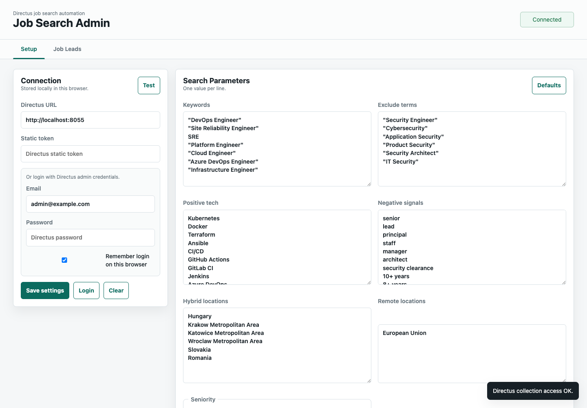
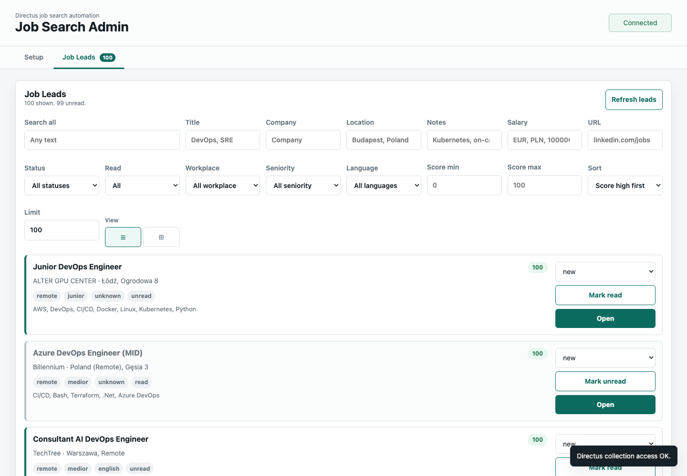
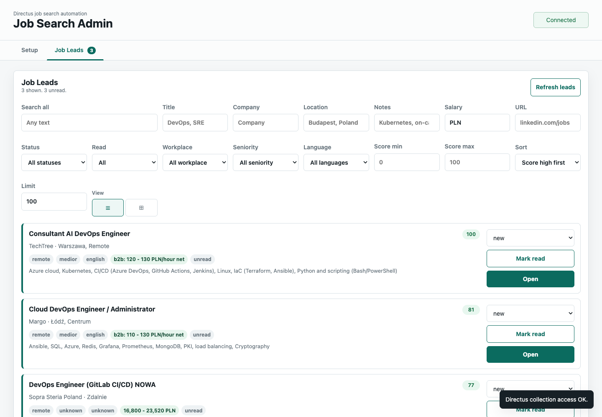

# Job Search Automation

[](https://github.com/nagyonmarci/jobs-hunter/actions/workflows/ci.yml)
[](https://github.com/nagyonmarci/jobs-hunter/actions/workflows/ci.yml)
[](https://securityscorecards.dev/viewer/?uri=github.com/nagyonmarci/jobs-hunter)
[](LICENSE)
[](package.json)

This is a small TypeScript/Node.js tool for tracking DevOps/SRE/Platform job leads in Postgres.

It does not scrape LinkedIn behind login. Instead it:

- generates targeted LinkedIn search URLs from your filters,
- stores search runs in Postgres,
- imports public job cards from LinkedIn, No Fluff Jobs, Just Join IT, We Work Remotely, and EuroTopTech into Postgres,
- ingests selected job leads from JSON into Postgres,
- keeps status, score, public salary, notes, language, workplace, and seniority in one backend.

## Docker Compose

Create the environment file:

```bash
cp .env.example .env
```

Edit `.env` and set strong values for:

- `POSTGRES_PASSWORD`
- `ADMIN_USER`
- `ADMIN_PASSWORD`

Start the stack:

```bash
docker compose up -d
```

Services:

- Admin UI + job importer API, behind Basic Auth: `http://localhost:4180`
- Postgres: internal Docker network only

Required tables (`job_leads`, `job_search_runs`, `base_cv`, `app_settings`) are created automatically on first boot.

## Admin UI

Open:

```text
http://localhost:4180/admin.html
```

Your browser will prompt for the `ADMIN_USER` / `ADMIN_PASSWORD` credentials from `.env`.

The admin UI lets you:

- edit keywords, hybrid locations, remote locations, seniority, and posted-within window,
- generate LinkedIn search URLs,
- save generated search runs,
- import concrete jobs from selected public sources,
- manually add reviewed job leads,
- review job leads with search, per-field filters, salary filtering, sorting, and read/unread marking,
- filter out expired listings (hidden by default), manually mark individual leads as expired,
- trigger expiry detection across all leads via **Detect expired** (URL 404 check for non-LinkedIn sources, time-based fallback via `EXPIRE_AFTER_DAYS`, default 30),
- generate an ATS-optimised, role-tailored CV for a selected lead via **Generate CV** (see [CV generation](#cv-generation)).

## Screenshots

### Search Setup



### Job Leads



### Salary Filter



To refresh these screenshots locally, start a Chrome instance with remote debugging and run the capture script:

```bash
/Applications/Google\ Chrome.app/Contents/MacOS/Google\ Chrome --headless=new --remote-debugging-port=9223 --user-data-dir=/tmp/jobs-hunter-chrome --window-size=1440,1000 about:blank
node --import tsx/esm scripts/capture-readme-screenshots.ts
```

## CV generation

The admin UI includes a **Generate CV** button on each job lead. It:

1. screenshots the job posting URL with Puppeteer if no description is stored yet,
2. extracts visible text via OpenAI Vision (GPT-4o),
3. reads your master CV from the `base_cv` table,
4. calls the configured LLM to produce an ATS-optimised, role-tailored CV in Markdown,
5. converts it to PDF and saves it to local disk.

**Requirements:**

- Add your master CV text in the admin UI's **Base CV** section (Setup tab).
- Set these fields in the admin UI's Setup tab (stored in the `app_settings` table):

  | Field               | Description                                |
  | ------------------- | ------------------------------------------ |
  | `preferred_llm`     | `openai`, `anthropic`, or `gemini`         |
  | `openai_api_key`    | required for GPT-4o Vision text extraction |
  | `anthropic_api_key` | required when `preferred_llm = anthropic`  |
  | `gemini_api_key`    | required when `preferred_llm = gemini`     |

The generated CV (Markdown + PDF) is stored on the job lead record; the PDF is downloadable at `/cvs/:filename`.

## Generate LinkedIn searches

Edit [config/searches.json](config/searches.json).

Current logic:

- hybrid: Hungary, southern Poland, Slovakia, Romania
- remote: European Union
- seniority: entry + associate, which maps roughly to junior + medior
- posted-within is edited in hours in the admin UI, then converted to LinkedIn's `r<seconds>` format
- role queries use tighter phrases such as `"Site Reliability Engineer"` instead of loose `SRE English`
- noisy security roles are excluded with `NOT "Security Engineer"`, `NOT "Cybersecurity"`, and similar terms
- positive tech terms such as Kubernetes, Docker, Terraform, CI/CD, Azure, AWS, Linux, and Python increase score
- negative signals such as senior, lead, principal, staff, architect, manager, and high years-of-experience requirements lower score or filter jobs out
- `minimumScore` controls how strict the importer is before creating a lead
- allowed languages controls which detected languages are imported; English, Hungarian, mixed, and unknown are enabled by default
- blocked languages are stronger than allowed languages; `other` is blocked by default, and `unknown` can be blocked if you want strict language detection

Run:

```bash
npm run search:linkedin
```

The generated URLs are saved into the `job_search_runs` table.

To test the search strategy without saving results:

```bash
npm run search:linkedin:dry
```

## Import Job Leads

After saving search runs, open the admin UI and click **Import jobs** in the **Import Jobs** panel.

The importer:

- reads the latest saved `job_search_runs`,
- fetches the selected public source pages,
- parses visible job cards into `job_leads`,
- stores public salary or compensation text when the source exposes it,
- backfills salary on existing leads when the URL already exists and the salary field is still empty,
- detects LinkedIn "No longer accepting applications" and Just Join IT "Offer expired" on enriched leads and marks them `is_expired`,
- skips new LinkedIn leads already marked "No longer accepting applications" without saving them,
- skips existing leads by URL,
- filters obvious senior/lead/principal/staff roles,
- filters obvious non-Hungarian/non-English titles,
- keeps noisy security roles out using the configured exclude terms.
- scores jobs by seniority, location/workplace, positive tech matches, and negative signals.

Supported source adapters:

- LinkedIn: uses saved search runs.
- No Fluff Jobs: uses configured search URLs from `source.nofluffjobs.searchUrls`; imports visible salary ranges when shown on the listing card.
- Just Join IT: uses configured search URLs from `source.justjoinit.searchUrls`; imports structured `employmentTypes` salary ranges and ignores empty `0 - 0` ranges.
- We Work Remotely: uses configured search URLs from `source.weworkremotely.searchUrls`.
- EuroTopTech: uses configured search URLs from `source.eurotoptech.searchUrls`; imports public total compensation.

Remote Rocketship and Wellfound are not enabled as source adapters because their public pages currently return bot/JavaScript protection to server-side fetches, which would make unattended imports unreliable.

You can also run it from the command line:

```bash
npm run import:linkedin -- --run-limit=25 --max-jobs-per-run=25
```

To test without writing leads:

```bash
npm run import:linkedin:dry -- --run-limit=1 --max-jobs-per-run=5
```

Inside Docker:

```bash
docker compose run --rm --entrypoint node importer scripts/linkedin-importer.js --run-limit=25 --max-jobs-per-run=25
```

## Stop the stack

```bash
docker compose down
```

Delete persisted local data:

```bash
docker compose down -v
```

## Ingest shortlisted jobs

Create a JSON file like [data/jobs.sample.json](data/jobs.sample.json), then:

```bash
npm run ingest:jobs
```

Statuses to use:

- `new`
- `shortlisted`
- `applied`
- `rejected`
- `ignored`

## Why this shape

LinkedIn automation that logs in, scrapes pages, or submits applications is brittle and can risk the account. This setup keeps the reliable part automated: search generation, structured tracking, dedupe, and application pipeline state in Postgres.

## Development

Install dependencies and the local pre-commit hooks:

```bash
npm install
```

Common tasks:

```bash
npm run typecheck      # TypeScript
npm run format         # Prettier (write)
npm run format:check   # Prettier (verify)
npm test               # Vitest (watch)
npm run test:run       # Vitest (single run)
npm run test:coverage  # Vitest + v8 coverage
```

`lint-staged` runs Prettier on staged files via the
`pre-commit` hook; the `pre-push` hook runs the test suite.

### Docker image

The [`Dockerfile`](Dockerfile) builds a single `app` target: the Node runtime
serving the admin UI, importer API, and search scripts, published as
`ghcr.io/nagyonmarci/jobs-hunter-app`.

Build it locally:

```bash
docker build -t jobs-hunter-app:dev .
docker run --rm jobs-hunter-app:dev scripts/generate-linkedin-searches.js --dry-run
```

## Continuous integration

Every push and pull request runs:

- Prettier check and the LinkedIn search dry-run on Node 20 and 22
- Vitest with v8 coverage (artifact uploaded for Node 20)
- gitleaks secret scanning
- CodeQL and Semgrep static analysis
- Hadolint (Dockerfile) and Checkov (IaC) scanning
- A build of the image plus a Trivy vulnerability scan
- dependency review on pull requests

Format/tests, secret scanning, CodeQL, and the image build plus smoke
test block the build; Semgrep, Hadolint, Checkov, Trivy, and dependency
review are informational and publish to the **Security → Code scanning** tab.
A sticky `security-summary` comment reports per-check status on each pull
request.

OSSF Scorecard runs weekly and on every push to `main`. Dependabot opens
weekly updates for npm packages, GitHub Actions, and the Dockerfile base
image; patch and minor updates are auto-merged once CI passes, major updates
require manual review.

## Releases

Pushes to `main` publish `latest` and `sha-<short>` images; pushing a
`vMAJOR.MINOR.PATCH` tag additionally publishes semver-tagged images and
creates a GitHub release with auto-generated notes. The
[`release` workflow](.github/workflows/release.yml) builds the `app` image
for `linux/amd64` and `linux/arm64`, attaches SLSA
provenance and an SBOM, and signs the image with cosign (keyless OIDC).

Verify a published image's signature:

```bash
cosign verify \
  --certificate-identity-regexp "https://github.com/nagyonmarci/jobs-hunter/.github/workflows/release.yml@.*" \
  --certificate-oidc-issuer https://token.actions.githubusercontent.com \
  ghcr.io/nagyonmarci/jobs-hunter-app:latest
```

## Security

Please follow [SECURITY.md](.github/SECURITY.md) to report
vulnerabilities privately rather than opening a public issue.

Container images are signed with cosign and ship with an SBOM and SLSA
provenance; see [Releases](#releases) for verification. The CI security
gates and recommended branch protection are documented in
[SECURITY.md](.github/SECURITY.md).
